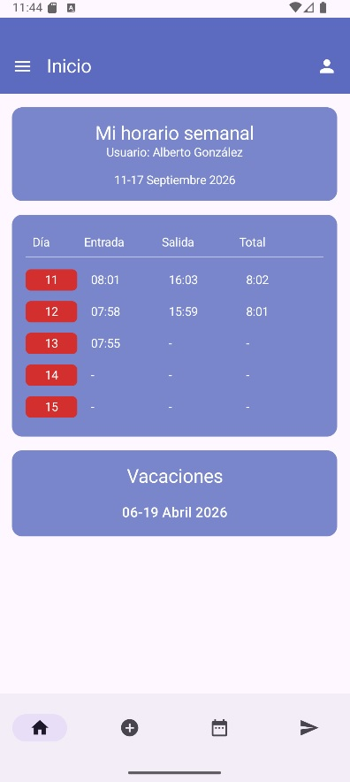
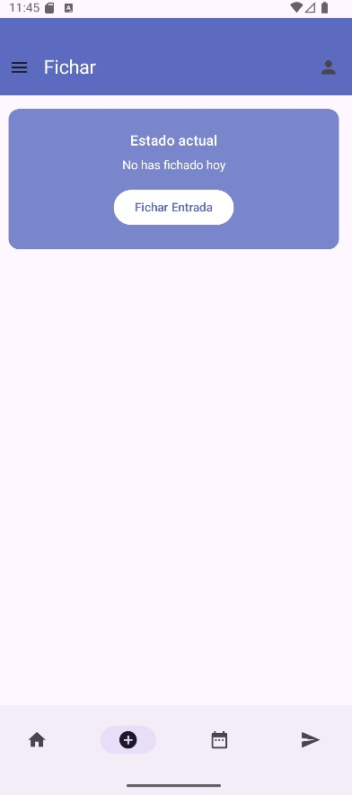
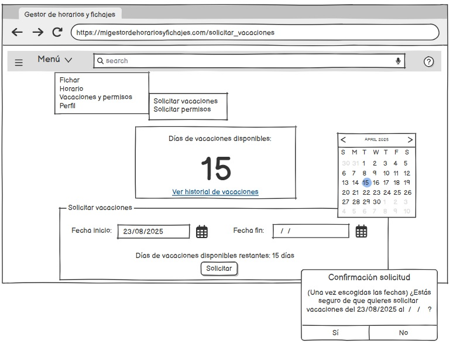

# Manual de usuario funcional

## 1. Acceso al sistema

1. Abrir la aplicacion web en el navegador.
2. Acceder a `/login`.
3. Introducir email y contrasena.
4. Al validar, el sistema muestra la pantalla principal correspondiente al rol.

Usuarios de demostracion definidos en el proyecto:

| Perfil | Email | Contrasena | Origen |
| --- | --- | --- | --- |
| Administrador | `admin@piamarsa.com` | `piamarsa` | `DataSeedConfig` |
| Gestor principal | `admin.amarsa@amarsa.com` | `pass.amarsa` | `DataSeedConfig` |

Capturas disponibles:

## 2. Pantalla principal

Desde la pantalla principal el empleado puede acceder a:

- Registro de entrada y salida.
- Horario personal.
- Historial de fichajes.
- Solicitud de cambios.
- Vacaciones.
- Consulta de convenio, si esta habilitada.
- Bolsa de horas, si el perfil tiene acceso al resumen.

## 3. Registro de fichaje

### Registrar entrada

1. Entrar como empleado.
2. Abrir la pantalla de fichaje.
3. Pulsar la accion de entrada.
4. El sistema registra la fecha y hora de inicio de jornada.

### Registrar salida

1. Entrar con un fichaje activo.
2. Pulsar la accion de salida.
3. El sistema completa el fichaje con fecha y hora de salida.

## 4. Historial y solicitudes de cambio

1. Abrir `Historial de fichajes`.
2. Revisar los registros anteriores.
3. Si hay una incidencia, enviar una solicitud de cambio.
4. El administrador revisa la solicitud desde la pantalla de solicitudes y la aprueba o rechaza.

## 5. Consulta de horario personal

1. Acceder a `Horario personal`.
2. Revisar los turnos asignados.
3. Comprobar si existe jornada partida: el sistema muestra tramo de manana y tramo de tarde cuando ambos estan definidos.
4. Revisar festivos marcados en el calendario personal.
5. Descargar el horario en PDF cuando se requiera justificante o copia.

## 6. Vacaciones y ausencias

### Solicitar vacaciones

1. Abrir `Vacaciones`.
2. Seleccionar fechas.
3. Enviar solicitud.
4. Esperar resolucion del administrador.
5. Si hay solicitudes rechazadas antiguas, usar la opcion de limpieza de rechazadas para despejar el historial.

### Gestionar vacaciones como administrador

1. Acceder al panel de administracion.
2. Revisar solicitudes pendientes.
3. Aprobar o rechazar.
4. Verificar que el calendario global queda actualizado.
5. Si procede, borrar una solicitud desde el calendario global.

## 7. Gestion administrativa

El perfil administrador puede:

- Crear, editar y eliminar empleados.
- Asignar ausencias.
- Crear plantillas de horario.
- Asignar horarios a empleados.
- Gestionar calendarios laborales.
- Resolver solicitudes de vacaciones.
- Consultar informes y bolsa de horas.
- Subir y descargar el convenio colectivo.
- Descargar el cuadrante mensual del equipo en PDF.
- Consultar contratos y horas teoricas mediante los endpoints disponibles.

## 8. Bolsa de horas e informes

1. Acceder a `Bolsa de horas`.
2. Revisar el saldo anual acumulado.
3. Comparar horas fichadas con horas teoricas previstas.
4. Generar o consultar el informe cuando sea necesario para seguimiento interno.

## 9. App movil

La app Android permite:

- Iniciar sesion contra la API REST.
- Consultar empleados.
- Consultar fichajes.

Para usarla en entorno local, el backend debe estar ejecutandose y la URL base de Retrofit debe apuntar al servidor Spring Boot.
